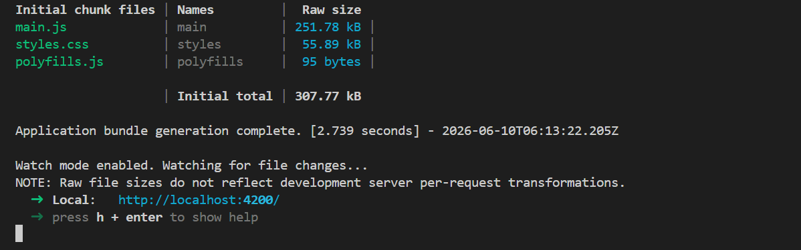
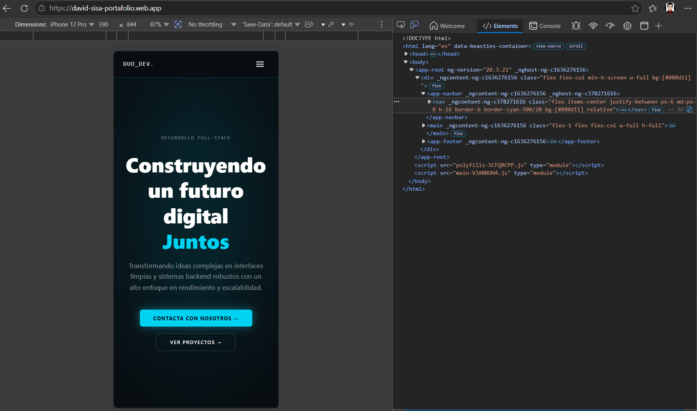
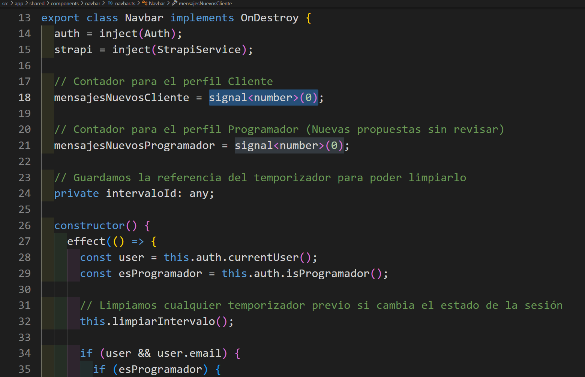
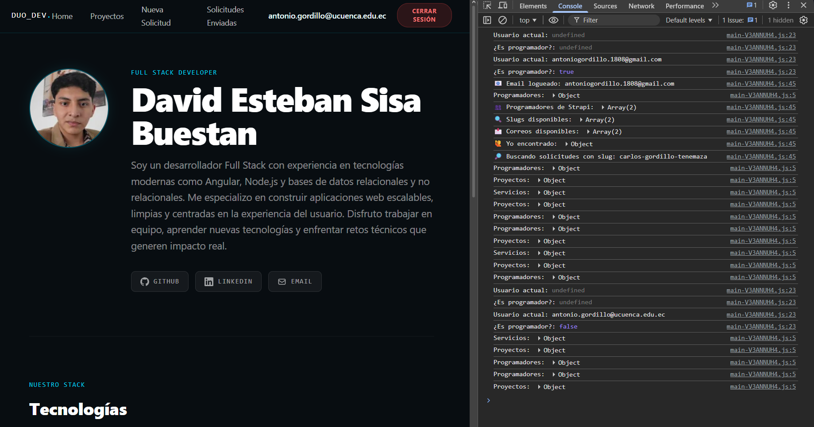
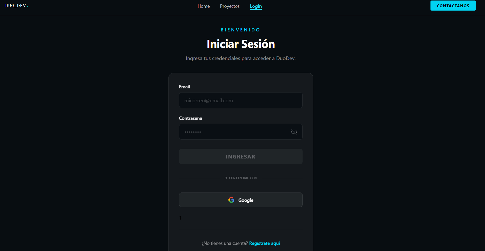
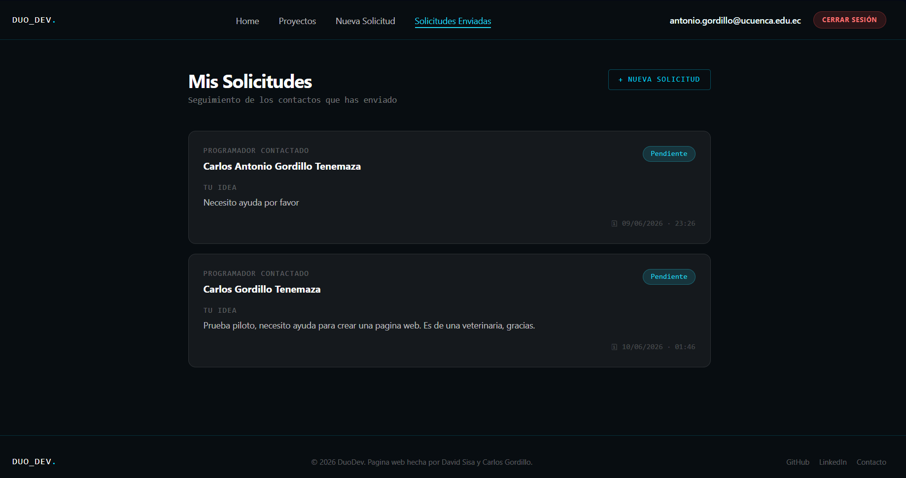
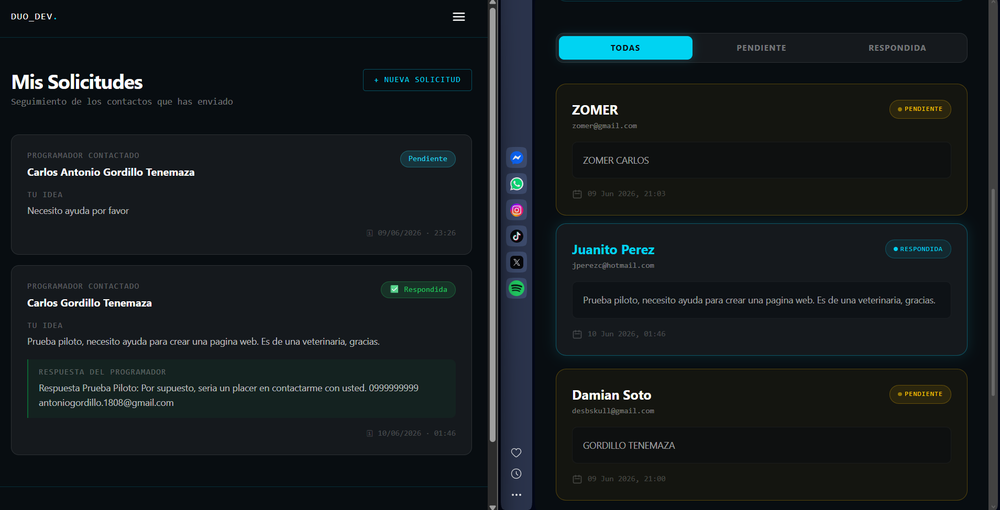
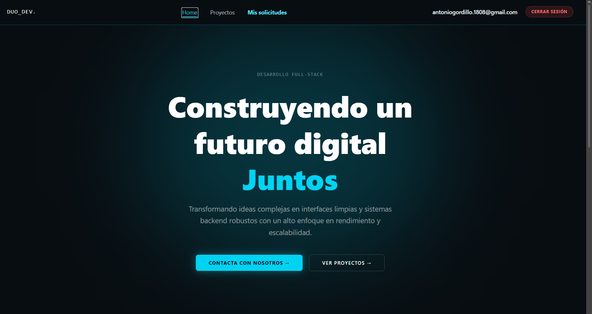

# Portafolio de Servicios - DUO_DEV


## Información General

<div align="center">
  
  <span style="font-size: 60px; color: #4b5563; margin: 0 15px;">+</span>
  
  <span style="font-size: 60px; color: #4b5563; margin: 0 15px;">+</span>
  
</div>

- **Proyecto:** Integrador - Aplicación Web Portafolio de Servicios
- **Asignatura:** Programación y Plataformas Web
- **Carrera:** Ingeniería en Computación
- **Semestre:** 5to Semestre
- **Docente:** Ing. Pablo Torres


---

## Autores

**Carlos Antonio Gordillo Tenemaza**
* Correo: [antoniogordillo.1808@gmail.com](mailto:antoniogordillo.1808@gmail.com)  
* GitHub: [antonikr8s](https://github.com/antonikr8s)  
* LinkedIn: [Carlos Gordillo](https://linkedin.com/in/carlos-antonio-gordillo-tenemaza-828540281/)  

**David Esteban Sisa Buestan**
* Correo: [sisabuestandavidesteban@gmail.com](mailto:sisabuestandavidesteban@gmail.com)  
* GitHub: [Riiiiii1](https://github.com/Riiiiii1)  
* LinkedIn: [David Sisa](https://www.linkedin.com/in/david-esteban-sisa-buestan)  


---

## Objetivo

Desarrollar una aplicación web interactiva tipo portafolio profesional multiusuario, utilizando Angular como framework frontend, Firebase para los servicios de autenticación y gestión de solicitudes, y Strapi como CMS Headless para la administración del contenido dinámico de la plataforma.

---

## Arquitectura del Sistema

El proyecto implementa una división estricta de responsabilidades para asegurar el rendimiento y la persistencia estructurada de los datos:

* **Frontend (Angular):** Interfaz de usuario responsiva adaptada para dispositivos móviles mediante Tailwind CSS. Administra el estado de la aplicación mediante el uso nativo de `Signals`.
* **CMS Headless (Strapi):** Conectado a una base de datos relacional PostgreSQL. Expone la API REST que provee la información pública de los programadores, tecnologías y proyectos en común.
* **Autenticación y Persistencia NoSQL (Firebase):** `Firebase Auth` controla el inicio de sesión (Email y Google). `Cloud Firestore` gestiona el almacenamiento en tiempo real del CRUD de las solicitudes de contacto enviadas por los usuarios externos.

---

## Fase 1: Configuración y Despliegue del Entorno de Desarrollo Local
Esta sección documenta el proceso técnico detallado para inicializar la arquitectura del proyecto en cualquier entorno de máquina local, garantizando la correcta comunicación entre la interfaz de usuario (Frontend), el administrador de contenido (Strapi CMS) y los servicios de autenticación y persistencia (Firebase).

---

### 1.1. Inicialización del Espacio de Trabajo y Resolución de Dependencias
El proyecto base requiere la instalación de un árbol de dependencias específico para integrar el framework con las librerías de terceros (ej. Firebase Web SDK). Al clonar el repositorio, es probable que los gestores de paquetes modernos detecten discrepancias en las versiones de dependencias pares (peer dependencies).

Para garantizar que el entorno se construya de forma íntegra sin interrumpir la compilación por advertencias de versiones, el desarrollador debe situarse en el directorio raíz del proyecto frontend y ejecutar:

```bash
npm install --legacy-peer-deps
```
Esta instrucción obliga al gestor de paquetes a instalar la estructura de módulos tal como fue concebida en la arquitectura original, estabilizando el entorno.

---

### 1.2. Exposición Segura del Backend y Túneles de Comunicación (Ngrok)
La plataforma web extrae información pública (catálogo de desarrolladores, proyectos y tecnologías) desde una **instancia local de Strapi CMS**. Para que el frontend logre consumir la API y visualizar los recursos multimedia sin sufrir bloqueos por **políticas de origen cruzado (CORS)** en los navegadores web modernos, es obligatorio exponer el puerto local de Strapi a internet mediante un **túnel seguro cifrado**.

Se utiliza la herramienta **Ngrok** para este propósito. Cada desarrollador que clone este repositorio debe poseer una **cuenta activa en Ngrok** y realizar los siguientes pasos en su terminal:

1. **Autenticación en la red de Ngrok:** Vincular la terminal con la cuenta personal utilizando el token criptográfico provisto en el panel de desarrollador de Ngrok.

```bash
ngrok config add-authtoken <TU_TOKEN_PERSONAL_DE_NGROK>
```

2. **Apertura del Túnel HTTP:** Exponer el puerto donde se encuentra corriendo la instancia local de Strapi. (Por defecto Strapi se despliega en el puerto 1337, pero el desarrollador debe verificar su configuración local).

```bash
ngrok http <PUERTO_LOCAL_DE_STRAPI>
```

Al ejecutar este comando, Ngrok devolverá una URL pública (`ej. https://aleatoria.ngrok-free.app`). Esta dirección debe ser copiada e inyectada en el archivo de variables de entorno de Angular (environment.ts) para establecer el puente de comunicación.

---

### 1.3. Configuración Administrativa de Perfiles en el CMS
Una vez que el backend y el frontend logran comunicarse exitosamente, el desarrollador debe ingresar al panel administrativo del CMS (http://localhost:<PUERTO_LOCAL_DE_STRAPI>/admin) para crear la entidad principal que permitirá a Firebase entrelazar las bases de datos.

1. Navegar hacia la colección Programador.

2. Crear un nuevo registro o editar el existente para rellenar los datos del desarrollador (Nombre, Especialidad, Tecnologías, Enlaces).

3. Parametrización Crítica (El Slug): El sistema exige de forma mandatoria definir un identificador único en el campo slug (por ejemplo: nombre-apellido-identificador).

4. Guardar y Publicar los cambios para que el contenido pase del estado borrador al entorno de producción de la API.

---

## Fase 2: Arquitectura del Sistema, Roles y Funcionalidades

### 2.1. Descripción de la Arquitectura del Sistema

El proyecto DUO_DEV se ha construido sobre un paradigma de Arquitectura de Software Desacoplada, permitiendo que cada capa del sistema opere de forma independiente para optimizar la escalabilidad y facilitar el mantenimiento. La interacción se divide en tres niveles fundamentales:

1. **Capa de Presentación (Frontend):** Desarrollada en Angular, esta capa gestiona la interfaz del usuario. Se ha implementado siguiendo un enfoque "Mobile First" mediante Tailwind CSS, asegurando una experiencia visualmente coherente en dispositivos móviles y de escritorio. El estado global de la aplicación se gestiona mediante Signals de Angular, eliminando la necesidad de suscripciones complejas y reduciendo el consumo de memoria.

2. **Capa de Contenido (CMS Headless):** Se utiliza Strapi como motor de administración de contenidos. Este CMS se encarga de la persistencia de datos relacionales (perfiles de programadores, stack tecnológico y portafolio de proyectos). Strapi expone una API REST que permite al frontend consumir datos dinámicos mediante peticiones HTTP.

3. **Capa Transaccional y de Identidad (BaaS):** Se ha delegado a Firebase la gestión de la lógica de negocio en tiempo real.

4. **Firebase Authentication:** Gestiona el ciclo de vida de las sesiones de usuario (registro, inicio de sesión y validación de tokens).

5. **Cloud Firestore:** Actúa como la base de datos NoSQL donde se persisten las solicitudes de contacto. Este servicio permite que las notificaciones entre el cliente y el programador sean bidireccionales y en tiempo real.

---

### 2.2. Roles y Funcionalidades del Sistema
El sistema define dos perfiles de acceso con permisos diferenciados, garantizando la seguridad de la información y la segregación de funciones:

**A. Usuario Final (Cliente Externo):**

* Exploración: Acceso público a la visualización de perfiles técnicos y proyectos destacados.

* Gestión de Interacción: Tras autenticarse de forma segura, el cliente puede acceder a formularios parametrizados para enviar ideas o requerimientos de software a un desarrollador específico.

* Historial y Notificaciones: Acceso a una bandeja de entrada personal donde el sistema refleja el estado de sus propuestas (Pendiente / Respondida) y permite visualizar las observaciones técnicas enviadas por el desarrollador.

**B. Administrador (Programador):**

* Panel de Control (Dashboard): Interfaz exclusiva protegida por guards de Angular que permite el monitoreo centralizado de los requerimientos entrantes.

* Gestión Reactiva: Implementación de filtros dinámicos que permiten segmentar las solicitudes según su estado, facilitando la priorización de tareas.

* Resolución Técnica: Herramientas de edición en tiempo real que permiten al administrador actualizar la información en la base de datos de Firestore, notificando inmediatamente al cliente sobre la resolución de su solicitud.

---

### 2.3. Gestión del Flujo de Solicitudes
El ciclo de vida de una solicitud ha sido diseñado para ser transparente y eficiente:

* Emisión: El cliente envía una propuesta desde el frontend, la cual se almacena en Cloud Firestore asociada al identificador (slug) único del programador.

* Recepción: El Dashboard del programador utiliza observadores en tiempo real sobre Firestore para detectar nuevos documentos, actualizando el contador de notificaciones de forma automática.

* Resolución: Una vez atendida la solicitud, el programador inyecta una observación técnica en la base de datos, lo que dispara un cambio de estado en el registro.

* Notificación: El sistema refleja el estado "Respondida" en la vista del cliente, permitiendo que este visualice la resolución definitiva de su requerimiento.

---

## Fase 3: Validación del Sistema y Plan de Pruebas
Esta sección documenta la batería de pruebas ejecutadas para validar la integridad del sistema. El cumplimiento de cada punto garantiza que la arquitectura híbrida (Angular + Firebase + Strapi) se integra correctamente en el entorno de producción.

---

### 3.1. Lista de Verificación (Checklist de Validación)
El sistema ha sido sometido a una batería de pruebas integrales, obteniendo los siguientes resultados:

### 1. Compilación sin errores:
**Descripción:** ng serve arranca de forma limpia en el entorno local.




### 2. Diseño Responsivo:
**Descripción:** Interfaz adaptativa en múltiples resoluciones (Escritorio/Móvil) usando el modo celular "iPhone 12 PRO".




### 3. Reactividad con Signals:
**Descripción:** Implementación de Angular Signals para el manejo eficiente del estado.




### 4.  Carga Dinámica (Strapi CMS):
**Descripción:** Integración completa mediante API REST para perfiles y proyectos.




### 5. Autenticación (Firebase Auth):
**Descripción:** Operatividad verificada con proveedores Google y Email/Password.




### 6. Persistencia en Firestore (CRUD): 
**Descripción:** Registro exitoso de solicitudes desde la capa de cliente




### 7. Panel en Tiempo Real: 
**Descripción:** Actualización dinámica en el Dashboard del programador.





### 8. Despliegue Global:
**Descripción:** Aplicación accesible mediante URL pública vía Firebase Hosting.



